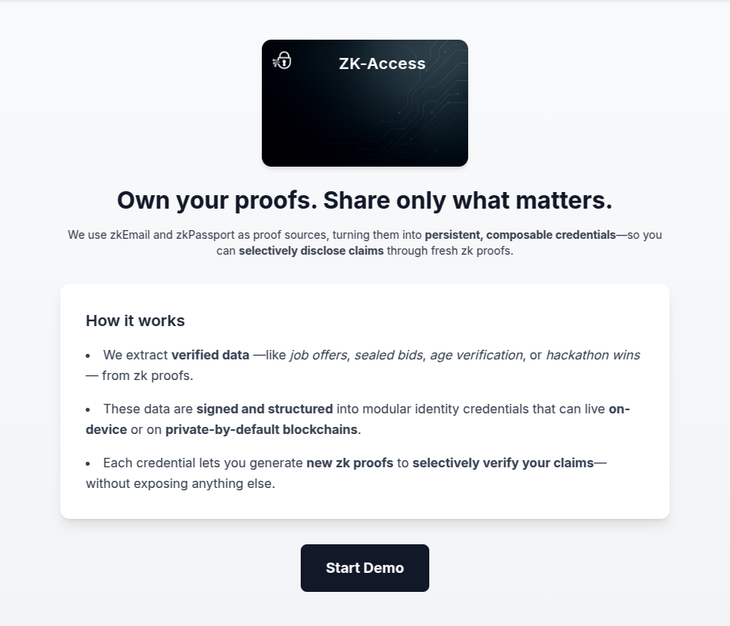

<p align="center">
  
</p>

<h1 align="center">ZK-Access</h1>

<p align="center">
  ZK-Access turns zk proofs into <strong>modular, persistent credentials</strong> that users can reuse across contexts — without re-proving everything from scratch.
</p>

---

## 🔍 What It Does

ZK-Access helps users **extract verified data from zk proofs** (like those from zkEmail or zkPassport) and turn it into **modular credentials** they can selectively disclose using new zk proofs.

For example, instead of generating three separate proofs for three job offers, a user can generate **one zk proof** that shows:  
> "I’ve received at least 3 offers that exceed yours — without revealing who made them or how much."

---

## 🧪 How It Works

1. **Extract** data from a valid zk proof (e.g., a job offer received by email).
2. **Structure** it into a signed, modular credential.
3. **Generate a fresh zk proof** from that credential to prove what matters, and nothing more.

All modular credentials:
- Live **off-chain** or on **privacy-preserving chains** like Aztec.
- Are **hashed** with Poseidon and **signed** using BabyJubJub-based EdDSA.
- Can be **composed** into a larger zk proof, combining claims like identity, age, and offers.

---

## 🔧 Circuit Logic (Noir)

The Noir circuit receives up to 10 key-value pairs, each of which is:

- Hashed using Poseidon
- Signed using EdDSA over BabyJubJub
- You must use one of the three operators, optionally comparing to a target value using operations like ==, >, or <, represented by 0, 1, or 2.

It supports a modular credential structure where only non-zero slots are processed.

```rust
use std::hash::poseidon;
use eddsa::eddsa_verify;

fn main(
    values: [Field; 10],
    keys: pub [Field; 10],
    hashes: pub [Field; 10],
    compared_values: pub [Field; 10],
    operations: pub [u8; 10],
    signature_R8xs: pub [Field; 10],
    signature_R8ys: pub [Field; 10],
    signature_Ss: pub [Field; 10],
    signer_x: pub Field,
    signer_y: pub Field,
) {
    for i in 0..10 {
        let stop_flag =
            (values[i] == 0) as u8 +
            (keys[i] == 0) as u8 +
            (hashes[i] == 0) as u8 +
            (compared_values[i] == 0) as u8 +
            (operations[i] == 0) as u8;
        let should_process = stop_flag != 5;

        if should_process {
            let hash_value = poseidon::bn254::hash_1([values[i]]);
            let hash_key = poseidon::bn254::hash_1([keys[i]]);
            let combined_hash = poseidon::bn254::hash_2([hash_key, hash_value]);
            assert(combined_hash == hashes[i]);

            if operations[i] == 0 {
                assert(values[i] == compared_values[i]);
            } else if operations[i] == 1 {
                let v = values[i] as u64;
                let c = compared_values[i] as u64;
                assert(v > c);
            } else if operations[i] == 2 {
                let v = values[i] as u64;
                let c = compared_values[i] as u64;
                assert(v < c);
            } else {
                assert(false);
            }

            let is_valid = eddsa_verify::<poseidon::PoseidonHasher>(
                signer_x,
                signer_y,
                signature_Ss[i],
                signature_R8xs[i],
                signature_R8ys[i],
                combined_hash
            );

            assert(is_valid);
        }
    }
}
```

---

## 📦 Credential Format

Each credential consists of:
- A **delegation** (issuer DID + signature over the entire credential)
- A `credentialSubject` containing key-value pairs that remain private to the holder only.

Within `circuitInputs.credentialSubject`, the following applies:
- Each key-value pair from the above `credentialSubject` private data is **individually Poseidon-hashed**.
- Each hash is rehashed using Poseidon.
- The final hash is **signed individually** with BabyJubJub.
- Strings (e.g., `"John"`, `"USD"`) are **converted into numerical values** before hashing.


This structure supports selective inclusion of any field in the zk proof.

```json
{
  "credentialSubject": {
    "firstname": "John"
  },
  "CircuitInputs": {
    "delegation": {
      "signer_x": "2046135483278802193382250450395523492100932844943110199678570650020127520911",
      "signer_y": "2620979215085524108106072114793342230673629628214020459503591305281855994281"
    },
    "firstname": {
      "hash": "<poseidon hash of this two combined><poseidon hash of 'firstname'/><poseidon hash of 'John'/>",
      "signature": {
        "R8x": "Signature applied to the hash",
        "R8y": "...",
        "S": "..."
      }
    }
  }
}
```

---
### Prover Example

In this example, we are proving that there are **three acquisition offers** greater than **500,000 USD**. Here's how it works:

- The `values` array contains the three acquisition offers: `800,000`, `1,000,000`, and `1,500,000 USD`.
- The `compared_values` array contains three `500,000 USD` values, which are the threshold to compare against.
- The `operations` array uses `1` for each comparison, meaning each acquisition offer is being checked to see if it is greater than the `500,000 USD` threshold.

```json
{
  "values": ["800000", "1000000", "1500000", 0, 0, 0, 0, 0, 0, 0],
  "keys": [
    "148075998654880541215842830160344016242",
    "148075998654880541215914887754381944178",
    "148075998654880541215986945348419872114",
    0, 0, 0, 0, 0, 0, 0
  ],
  "compared_values": ["500000", "500000", "500000", 0, 0, 0, 0, 0, 0, 0],
  "operations": [1, 1, 1, 0, 0, 0, 0, 0, 0, 0],
  "hashes": [
    "5366719375994759636904404180998763982021366406042507790915552675320521771068",
    "13323871709439665891260007857896986571152387134052948088283878279824861188533",
    "19638298229069844842017262203544560046611538999677861253136393249941873528030",
    "0", "0", "0", "0", "0", "0", "0"
  ],
  "signature_R8xs": [
    "13002153812156373249990981593180638937036667878367606085389374543066593006225",
    "608531663220951016662509278394775487793145873143918845127975337521345194342",
    "13169154699769769542748201559129809346377899257394554837158454728509935306506",
    "0", "0", "0", "0", "0", "0", "0"
  ],
  "signature_R8ys": [
    "17500566416431864035336449863952600816081743831636534779242734290218517156310",
    "6230448208871481112583678897378695896887438341581291680354345749440472725894",
    "3159692128329559535996229289614484936203147428392870913621853400499809396139",
    "0", "0", "0", "0", "0", "0", "0"
  ],
  "signature_Ss": [
    "1658879383340335091247016835335256507840195899709034880603746036782115526451",
    "2224586998918528195929303049173912225062515282965244201147117274934700961523",
    "1364101929582381831049477345730396709590294104408983028145789249821049998512",
    "0", "0", "0", "0", "0", "0", "0"
  ],
  "signer_x": "2046135483278802193382250450395523492100932844943110199678570650020127520911",
  "signer_y": "2620979215085524108106072114793342230673629628214020459503591305281855994281"
}
```
---

## 💼 Use Case — Sealed Business Negotiations

You're selling your company. A buyer makes you an offer. You want to prove:

> "I've received 3 better offers — one 20% higher, one 30%, and one 40% — without revealing who made them or how much."

With ZK-Access:
- Each offer is parsed from a zkEmail.
- They’re structured into modular credentials.
- One fresh zk proof proves the full story.    
✅ Just one proof. No unnecessary disclosure.

---

## 🧠 Why It Matters

By separating proofs from data, ZK-Access introduces a **new abstraction layer**: persistent, signed claims that can be reused, extended, and verified in private.

Use them across multiple proofs — without ever exposing the raw data.

---

## 🔒 Key Features

- **Composable Identity**: Break identity into reusable claims.
- **Selective Disclosure**: Prove facts like "offer > $100k" without revealing the sender or content.
- **Verifiable & Portable**: All claims are signed and can be proven independently.
- **Flexible Storage**: Use it from your device or on Aztec-compatible chains.

---

## 🧱 Tech Stack

- **Frontend**: Next.js + Tailwind CSS
- **Backend**: NestJS, Veramo, zkEmail SDK
- **ZK Circuit**: Noir (`main.nr`) for proof verification
- **Storage**: Off-chain or on Aztec L2
- **Signing**: Poseidon hash + BabyJubJub signature

---

## 🚀 Getting Started

> ⚠️ For demo purposes, no Google OAuth setup is required. The app mocks email proofs using `.eml` files.

1. **Clone the repo**
```bash
git clone https://github.com/LuchoLeonel/zk-access
cd zk-access
```

2. **Start the backend**
```bash
cd backend
cp .env.example .env
yarn install
yarn dev
```

3. **Start the frontend**
```bash
cd frontend
cp .env.example .env
yarn install
yarn dev
```

Visit `http://localhost:3000` — and click “Start Demo”.


4. **Play with the credentials**

If you'd like to manually play with the circuit inputs from the credential after completing the flow, you can modify or add data in the `Prover.toml` file. After making changes, execute the following command to run the circuit:

```bash
cd circuit
nargo execute
```

Remember that `keys`, `values`, and `compared_values` strings are converted to `BigInt` with this function before being passed to the circuit:

```javascript
const keyBigInt = BigInt('0x' + Buffer.from(key).toString('hex'));
```

Additionally, for nested fields, the keys are combined before being converted to `BigInt`. For example:

```
const key = `offerAc[${index}].offer`;
```

---

## 📁 Folder Structure

- `/frontend` — Landing page + credential demo flow (`zk-email`, `zk-passport`)
- `/backend` — Email parsing, credential generation, proof generation API
- `/circuit` — Noir proof logic (.nr file)
- `/public/eml` — Mocked emails for demo

---

## 🤝 Credits

Built with ❤️ for the Noir Hackathon.
Special thanks to `zkEmail`, `zkPassport`, Noir and the Aztec community for tooling support.

---
