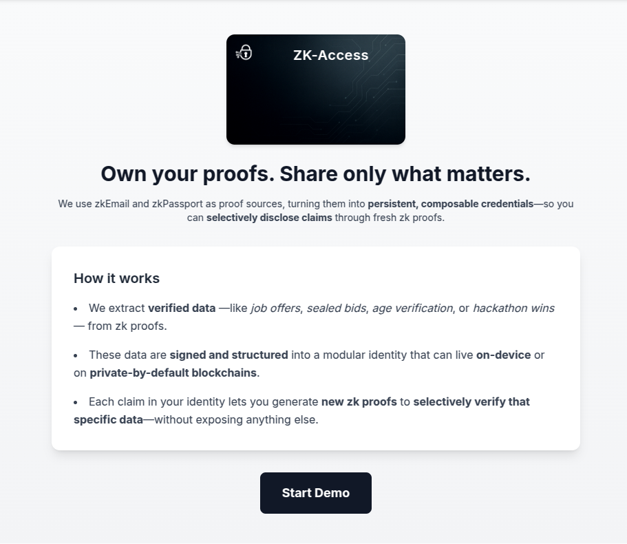

<p align="center">
  
</p>

<h1 align="center">ZK-Access</h1>

<p align="center">
  ZK-Access turns zk proofs into <strong>modular, persistent credentials</strong> that users can reuse across contexts — without re-proving everything from scratch.
</p>

---

## 🔍 What It Does

ZK-Access helps users **extract verified data from zk proofs** (like those from zkEmail or zkPassport) and turn it into **modular credentials** they can selectively disclose using new zk proofs.

For example, instead of generating three separate proofs for three job offers, a user can generate **one zk proof** that shows:  
> "I’ve received at least 3 offers that exceed yours — without revealing who made them or how much."

---

## 🧪 How It Works

1. **Extract** data from a valid zk proof (e.g., a job offer received by email).
2. **Structure** it into a signed, modular credential.
3. **Generate a fresh zk proof** from that credential to prove what matters, and nothing more.

All modular credentials:
- Live **off-chain** or on **privacy-preserving chains** like Aztec.
- Are **hashed** with Poseidon and **signed** using BabyJubJub-based EdDSA.
- Can be **composed** into a larger zk proof, combining claims like identity, age, and offers.

---

## 🔒 Key Features

- **Composable Identity**: Break identity into reusable claims.
- **Selective Disclosure**: Prove facts like "offer > $100k" without revealing the sender or content.
- **Verifiable & Portable**: All claims are signed and can be proven independently.
- **Flexible Storage**: Use it from your device or on Aztec-compatible chains.

---

## 💼 Use Case — Sealed Business Negotiations

You're selling your company. A buyer makes you an offer. You want to prove:

> "I've received 3 better offers — one 20% higher, one 30%, and one 40% — without revealing who made them or how much."

With ZK-Access:
- Each offer is parsed from a zkEmail.
- They’re structured into modular credentials.
- One fresh zk proof proves the full story.  
✅ Just one proof. No unnecessary disclosure.

---

## 🧱 Tech Stack

- **Frontend**: Next.js + Tailwind CSS
- **Backend**: NestJS, Veramo, zkEmail SDK
- **ZK Circuit**: Noir (`main.nr`) for proof verification
- **Storage**: Off-chain or on Aztec L2
- **Signing**: Poseidon hash + BabyJubJub signature

---

## 🚀 Getting Started

> ⚠️ For demo purposes, no Google OAuth setup is required. The app mocks email proofs using `.eml` files.

1. **Clone the repo**
```bash
git clone https://github.com/LuchoLeonel/zk-access
cd zk-access
```

2. **Start the backend**
```bash
cd backend
cp .env.example .env
yarn install
yarn dev
```

3. **Start the frontend**
```bash
cd frontend
cp .env.example .env
yarn install
yarn dev
```

Visit `http://localhost:3000` — and click “Start Demo”.

> Demo loads 3 mocked offers and shows how ZK-Access builds your modular identity.

---

## 📁 Folder Structure

- `/frontend` — Landing page + credential demo flow (`zk-email`, `zk-passport`)
- `/backend` — Email parsing, credential generation, proof generation API
- `/circuit` — Noir proof logic (WASM & .nr file)
- `/public/eml` — Mocked emails for demo

---

## 🤝 Credits

Built with ❤️ for the Noir Hackathon.  
Special thanks to `zkEmail`, `zkPassport`, Noir and the Aztec community for tooling support.

---